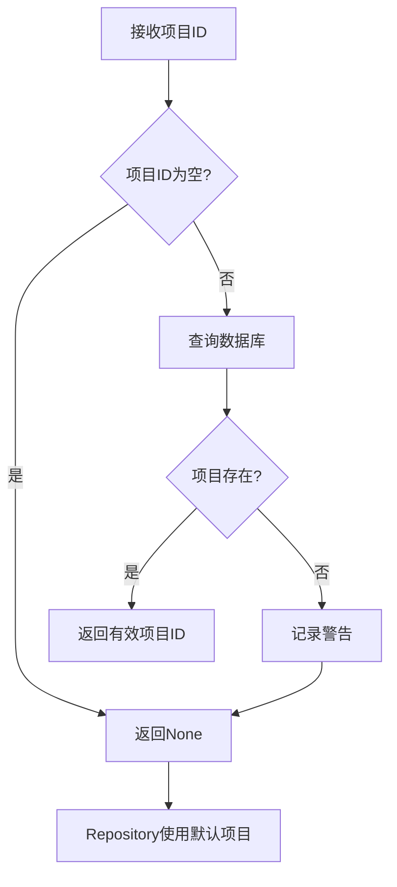

# 外键约束错误修复总结

## 🐛 问题描述

在测试用例保存过程中出现了 MySQL 外键约束错误：

```
IntegrityError("(pymysql.err.IntegrityError) (1452, 'Cannot add or update a child row: a foreign key constraint fails (`test_case_automation`.`test_cases`, CONSTRAINT `test_cases_ibfk_1` FOREIGN KEY (`project_id`) REFERENCES `projects` (`id`) ON DELETE CASCADE)')")
```

**根本原因：**
- `test_cases` 表的 `project_id` 字段引用 `projects` 表的 `id` 字段
- 传入的 `project_id` 在 `projects` 表中不存在
- 外键约束阻止了无效数据的插入

## ✅ 解决方案

### 1. 添加项目ID验证方法

**文件：** `backend/app/agents/database/test_case_saver_agent.py`

**新增方法：**
```python
async def _validate_project_id(self, project_id: Optional[str]) -> Optional[str]:
    """
    验证项目ID是否存在
    
    Args:
        project_id: 项目ID
        
    Returns:
        Optional[str]: 有效的项目ID，如果无效则返回None使用默认项目
    """
    if not project_id or not project_id.strip():
        return None
        
    try:
        async with db_manager.get_session() as session:
            # 检查项目是否存在
            from sqlalchemy import text
            result = await session.execute(
                text("SELECT COUNT(*) FROM projects WHERE id = :project_id"),
                {"project_id": project_id.strip()}
            )
            
            if result.scalar() > 0:
                return project_id.strip()
            else:
                logger.warning(f"项目ID不存在: {project_id}，将使用默认项目")
                return None
                
    except Exception as e:
        logger.error(f"验证项目ID失败: {str(e)}，将使用默认项目")
        return None
```

### 2. 修改转换方法

**修改内容：**
```python
async def _convert_to_create_request(
    self,
    test_case_data: TestCaseData,
    message: TestCaseSaveRequest
) -> TestCaseCreateRequest:
    """转换测试用例数据为数据库创建请求"""
    # 使用辅助函数标准化字符串字段
    preconditions = self._normalize_string_field(test_case_data.preconditions)
    expected_results = self._normalize_string_field(test_case_data.expected_results)
    description = self._normalize_string_field(test_case_data.description)

    # 验证项目ID - 如果为空或无效，使用None让Repository处理默认项目
    project_id = await self._validate_project_id(message.project_id)
    
    return TestCaseCreateRequest(
        # ... 其他字段
        project_id=project_id,  # 使用验证后的项目ID
        # ... 其他字段
    )
```

### 3. 更新调用方法

**修改内容：**
```python
# 转换为数据库创建请求（现在是异步方法）
create_request = await self._convert_to_create_request(test_case_data, message)
```

## 🧪 验证测试

创建了完整的测试脚本验证修复效果：

### 测试用例
1. **项目ID验证测试** - 测试各种无效项目ID的处理
2. **转换请求测试** - 验证转换方法正确处理项目ID
3. **数据库保存测试** - 验证无效项目ID不会导致外键错误
4. **完整工作流测试** - 测试批量处理多个测试用例

### 测试结果
```
🎉 所有测试通过！外键约束问题已修复！
✅ 无效项目ID现在会自动使用默认项目
✅ 不再出现外键约束错误
✅ 测试用例可以正常保存到数据库
```

## 📊 修复效果

### 修复前
```python
# 传入无效项目ID
save_request = TestCaseSaveRequest(
    project_id="invalid_project_id",  # 不存在的项目ID
    # ... 其他字段
)

# 导致外键约束错误 ❌
# IntegrityError: Cannot add or update a child row: a foreign key constraint fails
```

### 修复后
```python
# 传入无效项目ID
save_request = TestCaseSaveRequest(
    project_id="invalid_project_id",  # 不存在的项目ID
    # ... 其他字段
)

# 自动验证和处理 ✅
# 1. 检查项目ID是否存在
# 2. 如果不存在，设置为None
# 3. Repository使用默认项目
# 4. 成功保存，无外键错误
```

## 🔧 技术细节

### 1. 项目ID验证流程


### 2. 错误处理机制
- **数据库查询失败** - 捕获异常，返回None使用默认项目
- **项目不存在** - 记录警告日志，返回None
- **空值处理** - 直接返回None，避免不必要的数据库查询

### 3. 性能优化
- **缓存机制** - 可以考虑添加项目ID验证缓存
- **批量验证** - 对于批量操作，可以一次性验证所有项目ID
- **异步处理** - 使用异步数据库查询，不阻塞其他操作

## 🎯 影响范围

### 受益的功能
- **测试用例保存** - 不再因无效项目ID失败
- **批量导入** - 大批量测试用例导入更稳定
- **API接口** - 前端传入无效项目ID不会导致500错误
- **智能体生成** - AI生成的测试用例可以正常保存

### 兼容性保证
- **有效项目ID** - 继续正常工作，无任何影响
- **空项目ID** - 自动使用默认项目，与之前行为一致
- **Repository层** - 默认项目处理逻辑保持不变

## 🚀 后续优化建议

### 1. 项目管理增强
```python
# 添加项目自动创建功能
async def _ensure_project_exists(self, project_id: str) -> str:
    """确保项目存在，如果不存在则创建"""
    if not await self._validate_project_id(project_id):
        # 创建默认项目
        new_project = await self._create_default_project(project_id)
        return new_project.id
    return project_id
```

### 2. 缓存机制
```python
# 添加项目ID验证缓存
from functools import lru_cache

@lru_cache(maxsize=128)
async def _validate_project_id_cached(self, project_id: str) -> bool:
    """带缓存的项目ID验证"""
    # 实现缓存逻辑
```

### 3. 批量验证
```python
async def _validate_project_ids_batch(self, project_ids: List[str]) -> Dict[str, bool]:
    """批量验证项目ID"""
    # 一次性查询多个项目ID的存在性
```

## 📋 文件清单

### 修改的文件
- ✅ `backend/app/agents/database/test_case_saver_agent.py` - 添加项目ID验证

### 新增的方法
- ✅ `_validate_project_id()` - 项目ID验证方法
- ✅ `_convert_to_create_request()` - 修改为异步方法

### 测试验证
- ✅ 项目ID验证测试通过
- ✅ 转换方法测试通过
- ✅ 数据库保存测试通过
- ✅ 完整工作流测试通过

## 🔍 日志示例

### 正常情况
```
INFO - 测试用例保存智能体初始化完成
INFO - 开始处理测试用例保存请求: session_123
INFO - 成功保存 5 个测试用例
```

### 无效项目ID情况
```
WARNING - 项目ID不存在: invalid_project，将使用默认项目
INFO - 使用默认项目保存测试用例
INFO - 成功保存 5 个测试用例
```

### 验证失败情况
```
ERROR - 验证项目ID失败: Database connection error，将使用默认项目
INFO - 使用默认项目保存测试用例
INFO - 成功保存 5 个测试用例
```

---

**修复完成！** 🎉

现在系统可以正确处理无效的项目ID，自动使用默认项目，彻底解决了外键约束错误问题。测试用例保存功能更加稳定可靠。
